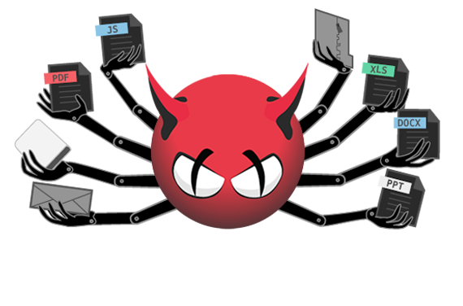

# Linux_AV
Explanations on how to install antivirus and firewall packages on popular Linux distributions (Ubuntu, Fedora, and Suse) 
and related projects along with a small project to scan your own server or system for beginners (because it has GUI)


**In addition to the mentioned content, there are two projects in this repository**
**1-install_AV : This Script Try to Install clamAV and Malware Detect and RootKitHunter Automatically.This script is mostly written for new and novice users because professional users are more interested in doing the steps themselves and customizing the settings more. **

**2-Scan_GUI : A Script with GUI to Scan and Update and Status simultaneously with all three tools with just one click**


## Scan_GUI


### Install

```
cd /tmp && wget  https://github.com/KooshaYeganeh/Linux_AV/archive/refs/heads/main.zip && unzip main.zip && cd Linux_AV-main && sudo mv Scan_GUI /usr/bin && cd 
```

### Run

Just Open Your Terminal and Type :

```
Scan_GUI
```


## install_AV

```
cd /tmp && wget https://github.com/KooshaYeganeh/Linux_AV/archive/refs/heads/main.zip && unzip main.zip && cd Linux_AV-main
```

Execute install_AV command with sudo to Install clamAV and RootkitHunter and MalwareDetetct:

```
sudo ./install_AV
```




## Ubuntu

### ClamAV

```
sudo apt-get install clamav clamav-daemon
```

**Updating the ClamAV Signature Database**

```
sudo systemctl stop clamav-freshclam
```
```
sudo freshclam
```

**ٔImportant Note : If an error occurs while updating the signatures, you can download the database separately and place it in your specified path.**


```
wget  https://database.clamav.net/daily.cvd
```

``` 
sudo mkdir /var/lib/clamav
```

```
mv daily.cvd /var/lib/clamav/daily.cvd
```

```
sudo systemctl start clamav-freshclam
```


### RKhunter

```
sudo apt update
```
```
sudo apt instaoll rkhunter
```


### Maldet ( Malware Detect)

```
sudo apt update 
```
```
sudo apt upgrade -y
```

```
sudo apt install wget -y
```

```
cd /tmp/
```

```
wget http://www.rfxn.com/downloads/maldetect-current.tar.gz
```

```
tar xfz maldetect-current.tar.gz
```
```
cd maldetect-1.6.4
```
```
./install.sh
```

```
cd maldetect-1.6.4
```

#### Configuring Maldet

```
sudo vi /usr/local/maldetect/conf.maldet
```
 
find the following lines and edit them to as below


```
# To enable the email notification.
email_alert="1"

# Specify the email address on which you want to receive an email notification.
email_addr="user@domain.com"

# Enable the LMD signature autoupdate.
autoupdate_signatures="1"

# Enable the automatic updates of the LMD installation.
autoupdate_version="1"

# Enable the daily automatic scanning.
cron_daily_scan="1"

# Allows non-root users to perform scans.
scan_user_access="1"
 
# Move hits to quarantine & alert
quarantine_hits="1"

# Clean string based malware injections.
quarantine_clean="0"

# Suspend user if malware found. 
quarantine_suspend_user="1"

# Minimum userid value that be suspended
quarantine_suspend_user_minuid="500"

# Enable Email Alerting
email_alert="1"

# Email Address in which you want to receive scan reports
email_addr="you@domain.com"

# Use with ClamAV
scan_clamscan="1"

# Enable scanning for root-owned files. Set 1 to disable.
scan_ignore_root="0"

```

#### Updating Maldet

First run the following command to create the correct paths for the logged-in user; you may have issues updating without doing this.


```
sudo /usr/local/sbin/maldet --mkpubpaths
```

To update the Maldet virus definitions database, execute the following command:

```
maldet -u
```


## Fedora

### ClamAV

```
sudo dnf upgrade --refresh
```

```
sudo dnf install clamav clamd clamav-update -y
```

### Update Virus Database 

```
sudo systemctl stop clamav-freshclam
```

```
sudo freshclam
```

**ٔImportant Note : If an error occurs while updating the signatures, you can download the database separately and place it in your specified path.**


```
wget  https://database.clamav.net/daily.cvd
```

``` 
sudo mkdir /var/lib/clamav
```

```
mv daily.cvd /var/lib/clamav/daily.cvd
```

```
sudo systemctl start clamav-freshclam
```


### RKhunter

```
cd /tmp
```

```
wget https://pilotfiber.dl.sourceforge.net/project/rkhunter/rkhunter/1.4.6/rkhunter-1.4.6.tar.gz
```

```
tar xvf rkhunter-1.4.0.tar.gz
```
```
cd rkhunter-1.4.0 
```

```
./installer.sh –layout default –install
```

```
/usr/local/bin/rkhunter –update
```
```
/usr/local/bin/rkhunter –propupd
```
```
cd
```


### Maldet ( Malware Detect)

```
cd /tmp/
```

```
wget http://www.rfxn.com/downloads/maldetect-current.tar.gz
```

```
tar xfz maldetect-current.tar.gz
```
```
cd maldetect-1.6.4
```
```
./install.sh
```

```
cd maldetect-1.6.4
```

#### Configuring Maldet

```
sudo vi /usr/local/maldetect/conf.maldet
```
 
find the following lines and edit them to as below


```
# To enable the email notification.
email_alert="1"

# Specify the email address on which you want to receive an email notification.
email_addr="user@domain.com"

# Enable the LMD signature autoupdate.
autoupdate_signatures="1"

# Enable the automatic updates of the LMD installation.
autoupdate_version="1"

# Enable the daily automatic scanning.
cron_daily_scan="1"

# Allows non-root users to perform scans.
scan_user_access="1"
 
# Move hits to quarantine & alert
quarantine_hits="1"

# Clean string based malware injections.
quarantine_clean="0"

# Suspend user if malware found. 
quarantine_suspend_user="1"

# Minimum userid value that be suspended
quarantine_suspend_user_minuid="500"

# Enable Email Alerting
email_alert="1"

# Email Address in which you want to receive scan reports
email_addr="you@domain.com"

# Use with ClamAV
scan_clamscan="1"

# Enable scanning for root-owned files. Set 1 to disable.
scan_ignore_root="0"
```

#### Updating Maldet

First run the following command to create the correct paths for the logged-in user; you may have issues updating without doing this.


```
sudo /usr/local/sbin/maldet --mkpubpaths
```

To update the Maldet virus definitions database, execute the following command:

```
maldet -u
```


## OpenSuse

### ClamAV

```
sudo zypper install pcre-devel clamav clamav-database clamav-nodb clamz
```
**Updating virus database signatures**

```
sudo freshclam
```

**ٔImportant Note : If an error occurs while updating the signatures, you can download the database separately and place it in your specified path.**


```
wget  https://database.clamav.net/daily.cvd
```

``` 
sudo mkdir /var/lib/clamav
```

```
mv daily.cvd /var/lib/clamav/daily.cvd
```

```
sudo systemctl start clamav-freshclam
```


### RKhunter

```
cd /tmp
```
```
wget https://pilotfiber.dl.sourceforge.net/project/rkhunter/rkhunter/1.4.6/rkhunter-1.4.6.tar.gz
```

```
tar xvf rkhunter-1.4.0.tar.gz
```
```
cd rkhunter-1.4.0
```
```
./installer.sh –layout default –install
```
```
 /usr/local/bin/rkhunter –update
```
```
/usr/local/bin/rkhunter –propupd
```
```
cd
```

#### Maldet ( Malware Detect)

```
sudo zypper install -n wget
```

```
cd /tmp/
```

```
wget http://www.rfxn.com/downloads/maldetect-current.tar.gz
```

```
tar xfz maldetect-current.tar.gz
```
```
cd maldetect-1.6.4
```
```
./install.sh
```

```
cd maldetect-1.6.4
```

#### Configuring Maldet

```
sudo vi /usr/local/maldetect/conf.maldet
```
 
find the following lines and edit them to as below


```
# To enable the email notification.
email_alert="1"

# Specify the email address on which you want to receive an email notification.
email_addr="user@domain.com"

# Enable the LMD signature autoupdate.
autoupdate_signatures="1"

# Enable the automatic updates of the LMD installation.
autoupdate_version="1"

# Enable the daily automatic scanning.
cron_daily_scan="1"

# Allows non-root users to perform scans.
scan_user_access="1"
 
# Move hits to quarantine & alert
quarantine_hits="1"

# Clean string based malware injections.
quarantine_clean="0"

# Suspend user if malware found. 
quarantine_suspend_user="1"

# Minimum userid value that be suspended
quarantine_suspend_user_minuid="500"

# Enable Email Alerting
email_alert="1"

# Email Address in which you want to receive scan reports
email_addr="you@domain.com"

# Use with ClamAV
scan_clamscan="1"

# Enable scanning for root-owned files. Set 1 to disable.
scan_ignore_root="0"

```

#### Updating Maldet

First run the following command to create the correct paths for the logged-in user; you may have issues updating without doing this.


```
sudo /usr/local/sbin/maldet --mkpubpaths
```

To update the Maldet virus definitions database, execute the following command:

```
maldet -u
```


## Run

### ClamAV

scan your whole system by running the following command in the terminal:

```
sudo clamscan --infected --recursive --remove /
```

Scaning directory : 

```
sudo clamscan --infected --remove --recursive /home/koosha/Desktop
```

### Rootkithunter

```
rkhunter -c
```


### MalwareDetect

Scan whole system : 

```
maldet -a /
```

From the result, you will get the scan report ID :
For Example report of 051013-1142.20920 :

```
maldet --report 051013-1142.20920
```

You can put the infected files to quarantine by running the below command.

```
maldet -q 051013-1142.20920
```


